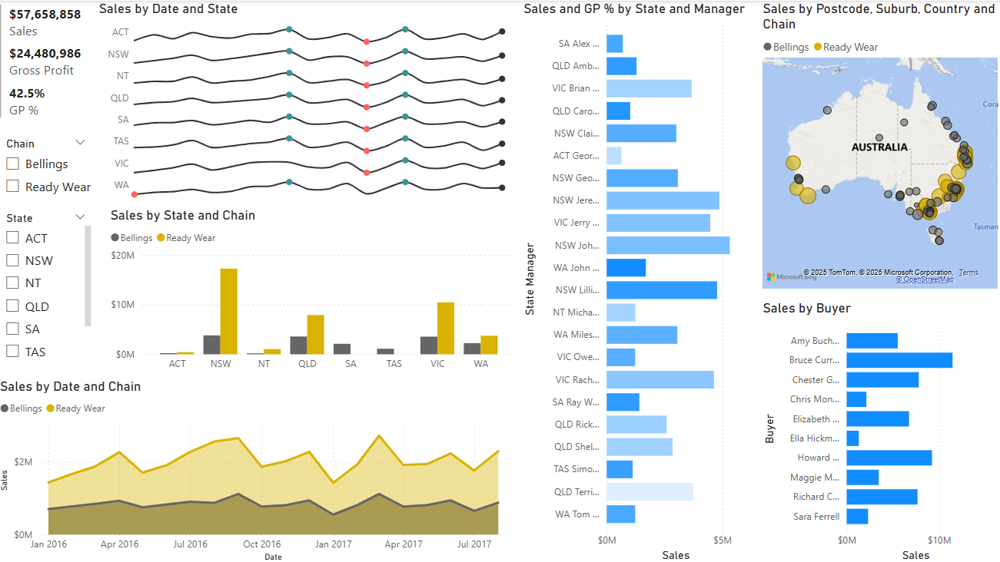

# Retail Sales Analysis Report

### Region & Chains Dashboard
 

### Summary Dashboard

## 1. Overview
The retail dashboard provides insights into sales performance across different states, chains, and categories. The data spans multiple fiscal quarters and highlights key trends in sales revenue, gross profit, and category performance.

Key Metrics:
Total Sales: $57.66M
Gross Profit: $24.48M
Gross Profit Percentage (GP%): 42.5%
Latest Quarterly Sales: $3.18M (Q1 2018)

## 2. Sales Performance Trends

### 2.1 Sales Over Time
Sales have shown periodic fluctuations, with peak sales occurring around the end of 2016 and throughout 2017.
Sales in Ready Wear consistently outperform Bellings, contributing the majority of revenue.
Quarterly revenue peaked in Q1 2017 at $10.4M, after which it stabilized around $8.6M per quarter before declining to $5.6M in Q1 2018.

### 2.2 State-Wise Sales Analysis
NSW and VIC contribute the highest sales revenue across all states.
QLD and WA also perform well but at lower levels than NSW and VIC.
ACT, NT, SA, and TAS have significantly lower sales, suggesting limited market penetration or demand.

### 2.3 Chain Performance (Bellings vs. Ready Wear)
Ready Wear dominates sales across all regions, significantly outperforming Bellings.
The market share of Ready Wear is approximately 75%, while Bellings holds about 25%.
In key states like NSW and VIC, Ready Wear leads by a substantial margin, highlighting a strong brand presence.

## 3. Sales by Product Categories

### The highest revenue-generating categories are:
Menswear
Shoes
Juniors
Home Products
Kidswear

### Groceries and Hosiery have the highest Gross Profit Percentage (~50%), indicating strong profit margins despite lower sales volume.
Accessories and Intimate wear contribute moderately but with lower GP%

## 4. Gross Profit & GP% Trends

Gross profit remains above 40% across most categories, indicating a healthy profit margin.
Highest GP% categories: Groceries, Hosiery, and Accessories.
Quarterly gross profit trends mirror sales trends, peaking in Q1 2017 before a decline in Q1 2018.

## 5. Sales by Buyers & Managers

### Top Buyers:
Bruce Curran
Chester Griffith
Amy Buchanan

### Top Performing Managers:
Several NSW and VIC managers lead in revenue generation, reinforcing the strength of these states.

## 6. Geographical Distribution of Sales
Sales are heavily concentrated in NSW, VIC, and QLD, with sparse representation in NT, TAS, SA, and ACT.
Regional sales concentration suggests urban market dominance, with fewer sales in rural or less populated areas.

# Key Findings

NSW and VIC dominate sales, followed by QLD and WA. Smaller states show limited revenue contribution.
Ready Wear significantly outperforms Bellings, holding a larger market share.
Men’s, Shoes, and Juniors categories drive revenue, while Groceries and Hosiery maintain high profit margins.
Sales peaked in Q1 2017 and have declined in Q1 2018, signaling potential market saturation or external economic factors.
Buyer and Manager performance varies, with a concentration of top performers in major states.
Recommendations
Expand Market Presence in Underperforming States

Increase promotional efforts in NT, TAS, SA, and ACT.
Consider targeted marketing strategies to boost sales.
Boost Bellings Sales Performance

Investigate why Bellings underperforms compared to Ready Wear.
Adjust pricing, branding, or distribution to increase sales.
Optimize Product Mix for Higher Profitability

Increase focus on high GP% categories like Groceries and Hosiery.
Maintain strong sales for Menswear and Shoes while exploring new trends.
Address Recent Sales Decline

Analyze reasons for the Q1 2018 drop in sales.
Implement strategic discount campaigns or customer engagement programs.
Enhance Regional Sales Distribution

Expand logistics and store presence in growth potential states.
Offer region-specific promotions to attract local customers.

# Conclusion
The retail business is performing well, particularly in NSW, VIC, and QLD, with a strong contribution from Ready Wear and high-margin categories. However, sales have declined in Q1 2018, and certain regions are underperforming. Strategic actions in market expansion, category focus, and competitive positioning will help sustain growth and improve profitability.

